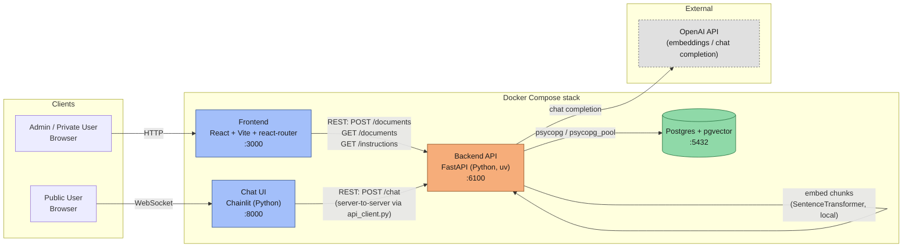
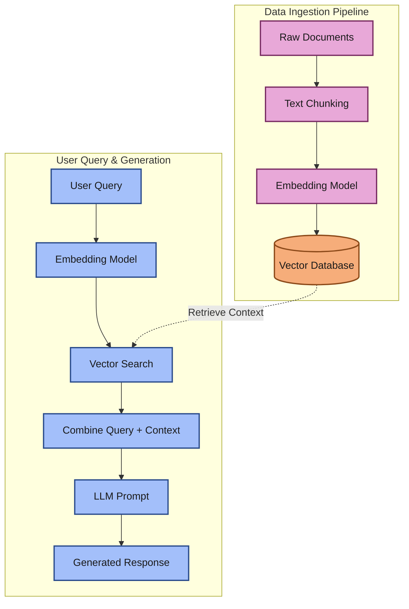
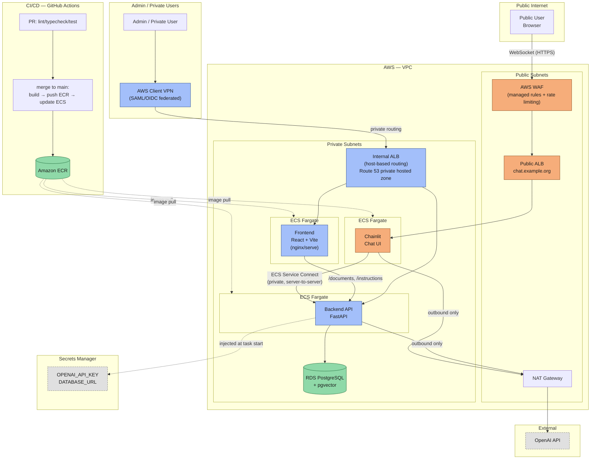
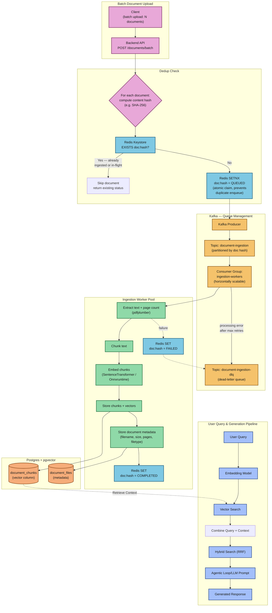
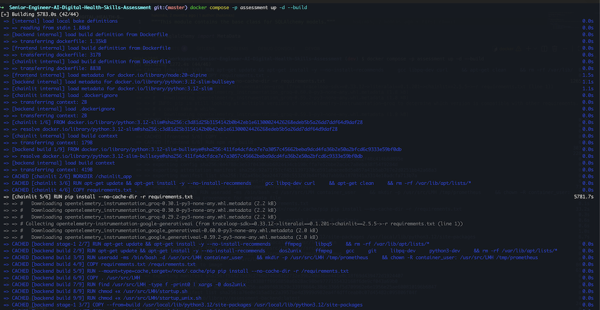
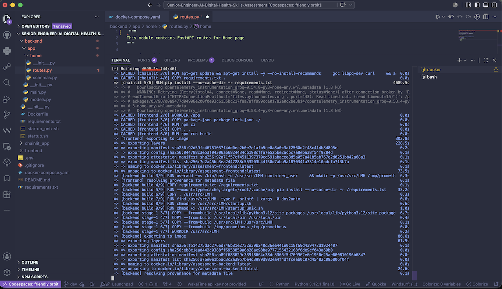

## Last Mile Health — Senior Full-Stack Engineer, AI & Digital Health Practice Assessment

### Table of Contents
- [Technologies](#technologies)
- [Prototyping](#prototyping)
- [Running the app](#running-the-app)
  - [Docker Compose](#docker-compose)
  - [Backend (FastAPI)](#backend-fastapi)
  - [Frontend (React)](#frontend-react)
  - [Chat UI (Chainlit)](#chat-ui-chainlit)
- [Architectural decisions & trade-offs](#architectural-decisions--trade-offs)
  - [RAG Pipeline](#rag-pipeline)
- [Production deployment plan](#production-deployment-plan)
  - [App Infra](#app-infra)
  - [Proposed Production RAG Pipeline, support batch process at scale](#proposed-production-rag-pipeline-support-batch-process-at-scale)
- [Challenges](#challenges)
- [AOB](#aob)

### Technologies
- Postgres/Pgvector to store document vectors
- FastAPI
- React-router
- chainlit - for PoC chat 
- RAG
  - Semantic transformation to vectors - have used *SentenceTransformer* for this exercise
  > For Production, *Onnxruntime* transformer can be used because it is much lighter

### Prototyping
Prototyped on jupyter notebooks `notebook > RAGWorkflow.ipynb` the full RAG workflow. This enabled testing pdf parsing libraries, chunking and vectorization, and connection and querying on pgvector.
The full [RAG Pipeline](#rag-pipeline) is prototyped in the [notebook](notebook/RAGWorkflow.ipynb)

Once prototyping was done, code from the notebook was scaffolded into backend FastAPI, frontend and chainlit using Claude Code 

---

## Running the app

### Docker Compose

Backend, frontend, the Chainlit chat UI, and Postgres+pgvector all run as one stack — each service
builds from its own multi-stage Dockerfile (`backend/Dockerfile`, `frontend/Dockerfile`,
`chainlit/Dockerfile`):

```
cp .env.example .env
# edit .env: set OPENAI_API_KEY
docker compose -p assessment up -d --build
```

| Service | Tech | URL | Directory |
|---|---|---|---|
| Backend | FastAPI (Python, `uv`) | http://localhost:3000 | `backend` (package at `backend/app`) |
| Frontend | React + Vite + react-router (TypeScript) | http://localhost:8000 | `frontend` |
| Chat UI | Chainlit (Python, `uv`) | http://localhost:6100 | `chainlit` |
| Database | PostgreSQL + pgvector | `localhost:5432` | — |

`docker-compose.yaml` points `DATABASE_URL` at the `relational_db` container automatically — you only
need to supply the API key(s) in `.env`. It's loaded into the backend container via `env_file` at
runtime, never baked into the image (`.env*` is excluded via `.dockerignore`). Stop everything with
`docker compose -p assessment down`.

> Running the docker command can take upto ten minutes (specifically the chainlit container build)

### Backend (FastAPI)

```
cd backend
uv sync
uv run uvicorn app.main:app --port 6100 --reload
```

On startup it idempotently creates the "documents" table and an HNSW index if they don't already exist —
no manual schema setup needed once Postgres+pgvector is reachable.

**Tests** (fast, no live Postgres or OpenAI key required — DB/embedder/LLM are mocked):
```
uv run pytest
```
**Integration test** (hits a real local Postgres+pgvector and calls OpenAI for real, end-to-end upload → chat):
```
RUN_INTEGRATION_TESTS=1 uv run pytest -m integration
```

Endpoints: `GET /health`, `POST /documents` (multipart PDF upload), `POST /chat` (`{"question": "..."}`).

### Frontend (React)

```
cd frontend
npm install
cp .env.example .env
npm run dev
```
Serves at `http://localhost:3000` — **the dev port is pinned in `vite.config.ts`** (Vite's default is
5173) because the backend's CORS allow-list only permits `localhost:3000`; running on a different port
will cause every API call to fail with a CORS error.

**Tests**:
```
npm test
```

### Chat UI (Chainlit)

An alternative chat interface to the React frontend's Chat page — a thin client that calls the same
backend `/chat` endpoint. Requires the backend to be running.

```
cd chainlit
uv sync
uv run chainlit run app.py --port 8000 -w
```

**Tests** (mocked HTTP calls, no live backend required):
```
uv run pytest
```

---

## Architectural decisions & trade-offs {#arch-tradeoff}


**React-router**: Is light weight compared to NextJs, which is a full-stack framework

**React Frontend**: Used for document uploads. This combo handles files upload, and visual tracking of uploaded files. Frontend handles document upload through a drag-n-drop dropzone, which sends to the backend.

**FastAPI Backend**: The uploaded file goes through the full rag pipeline, that is, the file is loaded -> transformed using the sentence transformer -> chunked -> vectorized -> and saved to pgvector.
The backend also handles queries against the database, and integrates chatting with the LLM to produce comprehensive results. 

The full [RAG pipeline](#rag-pipeline) is captured below

**Chainlit**: Exposes the public facing chat UI 
In the implemented architecture, the frontend and backend layers are accessible to admins only; closed behind either a firewall or private network. The chainlit layer is public

**Pgvectors**: Stores document vectors, uploaded documents metadata and other persistent data

> These can be in a private network, not accessible to the public, whilst Chainlit is public.

##### RAG Pipeline



## Production deployment plan

**Hybrid Search Pipeline using Agent**: Incorporate Hybrid search using Reciprocal Rank Fusion (RFF) for scoring on an agentic framework, building on the simple RAG pipeline. This would ensure robust results ranked by both text and vectors, with the *agentic loop* coming into play to ensure robust answers i.e. answers with additional queries automatically generated

**Ability to Create Knowledgebase**: Ability to create knowledgebase that bundle similar sources of information - in this case uploaded pdfs

**Litellm** - Wrap the LLM Api calls in litellm (An open gateway that unifies LLM APIs), which would enable quick switching between LLM providers

**Cloud provider**: AWS Backend and Chainlit as containerized services on Amazon Elastic Container Service(**ECS Fargate**), which is serveless compute infra, behind an Amazon Elastic Load Balance (**ALB**); frontend as a static build on **CloudFront**; database on **RDS for PostgreSQL** with the `pgvector` extension enabled, in a private subnet reachable only from the Fargate tasks.

**CI/CD** (using GitHub Actions):
- On every PR: lint + typecheck + test each service independently (`uv run pytest` for backend/chainlit,
  `npm test` + `tsc -b` for frontend) as a job; if fail, no deploy.
- On merge to `main`: build Docker images per service, push to (Elastic Container Registry) **ECR**, then update the corresponding
  ECS service; frontend build artifacts sync to **S3** with a CloudFront invalidation.
- Schema init already runs idempotently on backend startup, so no separate migration step is required for
  this scope — a longer-lived service would run migrations as an explicit pre-deploy step instead.

**Infrastructure considerations**:
- Secrets (`OPENAI_API_KEY`, `DATABASE_URL`, etc.) via **AWS Secrets Manager**, injected as task
  environment variables — never committed, never baked into images.
- `CORS_ORIGINS` set per-environment to the actual deployed frontend domain, not `localhost`.
<!--- `/health` semantics should move to "503 on DB-down" in production so both ALBs' target groups can
  actually route around an unhealthy instance.-->
- The `SentenceTransformer` embedder loads into memory once per instance at startup — size Fargate task
  memory accordingly and consider a minimum warm instance count to avoid cold-start latency on scale-out.
<!--- Connection pool size × number of backend replicas must stay under RDS's `max_connections`; add
  **PgBouncer** (or RDS Proxy) if the service scales beyond a handful of replicas.-->
- Structured logging + an error tracker (e.g. Sentry) wired into the existing global exception handler for
  production visibility beyond the current server-side traceback logging.

#### App Infra


#### Proposed Production RAG Pipeline, support **batch processing** at scale
**note**: use of redis keystore for checks before queueing, and Apache Kafka for queue management



---
### Challenges

The docker install threw me off since it was taking a non-trivial amount of time to install. 

> **Root cause:** the default repo chainlit docker image

Manually located the instructions file from 
<code>backend > app > home > routes.py</code>

locally (macos setup)


On github codespace


### AOB
**note**: Go to `dev` branch to view individual commits

##### *now that you're here you can also checkout the [scrabble app](https://github.com/dakn2005/scrabble-realtime) on this repository; click on the title link to take to the live deploy hosted on render*
