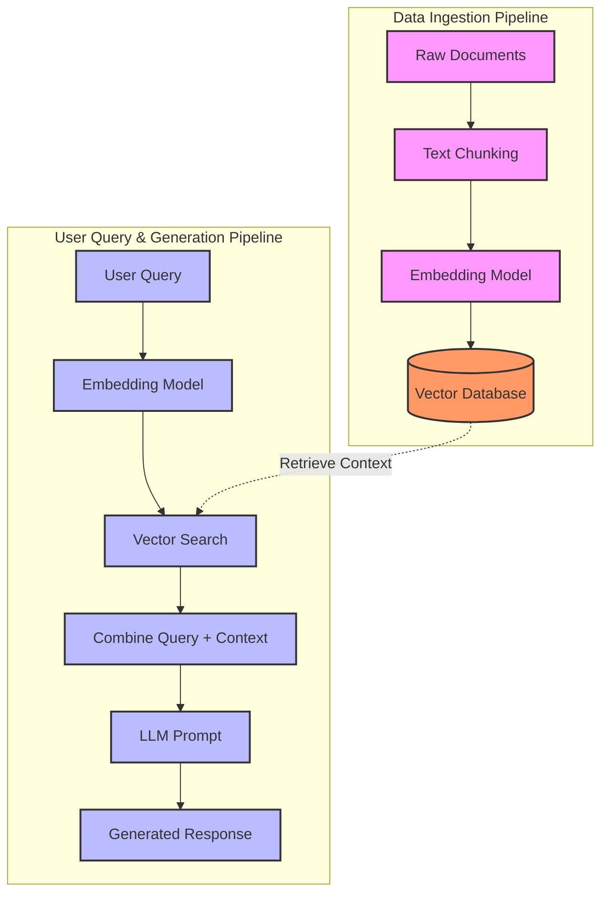

### Workflow
Building a basic RAG pipeline, this can be enhanced by building agents. The advantage of agents is ability to further query the data and have additional queries automatically generated through the *agentic loop*

### Technologies
- Postgres/Pgvector to store document vectors
- FastAPI
- React-router
- chainlit - for PoC chat 
- RAG
  - Semantic transformation to vectors - have used *SentenceTransformer* for this exercise
  > For Production, *Onnxruntime* transformer can be used because it is much lighter

### Prototyping
Prototyped on jupyter notebooks `notebook > RAGWorkflow.ipynb` the full RAG workflow. This enabled testing pdf parsing libraries, chunking and vectorization, and connection and querying on pgvector.
The full [RAG Pipeline](#rag-pipeline) is prototyped in the notebook

---

## Running the app

### Docker Compose (recommended)

Backend, frontend, the Chainlit chat UI, and Postgres+pgvector all run as one stack — each service
builds from its own multi-stage Dockerfile (`backend/Dockerfile`, `frontend/Dockerfile`,
`chainlit/Dockerfile`):

```
cp .env.example .env
# edit .env: set OPENAI_API_KEY (and ANTHROPIC_API_KEY if you use it)
docker compose -p assessment up -d --build
```

| Service | URL |
|---|---|
| Frontend | http://localhost:3000 |
| Chat UI (Chainlit) | http://localhost:8000 |
| Backend (API) | http://localhost:6100 |
| Database (Postgres) | `localhost:5432` |

`docker-compose.yaml` points `DATABASE_URL` at the `relational_db` container automatically — you only
need to supply the API key(s) in `.env`. It's loaded into the backend container via `env_file` at
runtime, never baked into the image (`.env*` is excluded via `.dockerignore`). Stop everything with
`docker compose -p assessment down`.

### Running services individually

Useful for iterating on one service without rebuilding images. Three independent services, each with
its own dependency management, live at the repo root:

| Service | Tech | Port | Directory |
|---|---|---|---|
| Backend | FastAPI (Python, `uv`) | `6100` | `backend` (package at `backend/app`) |
| Frontend | React + Vite + react-router (TypeScript) | `3000` | `frontend` |
| Chat UI | Chainlit (Python, `uv`) | `8000` | `chainlit` |
| Database | PostgreSQL + pgvector | `5432` | — |

Copy the root env file and fill in your keys before starting anything:

```
cp .env.example .env
# then edit .env: set OPENAI_API_KEY and DATABASE_URL
```

Postgres must already be running with the `pgvector` extension **available** (e.g. the
`pgvector/pgvector` Docker image, or `brew install pgvector` against a local Postgres) — the backend
runs `CREATE EXTENSION IF NOT EXISTS vector` and creates its own tables/indexes on startup, but it can't
install the extension binary itself.

### Backend (FastAPI)

```
cd backend
uv sync
uv run uvicorn app.main:app --port 6100 --reload
```

On startup it idempotently creates the "documents" table and an HNSW index if they don't already exist —
no manual schema setup needed once Postgres+pgvector is reachable.

**Tests** (fast, no live Postgres or OpenAI key required — DB/embedder/LLM are mocked):
```
uv run pytest
```
**Integration test** (hits a real local Postgres+pgvector and calls OpenAI for real, end-to-end upload → chat):
```
RUN_INTEGRATION_TESTS=1 uv run pytest -m integration
```

Endpoints: `GET /health`, `POST /documents` (multipart PDF upload), `POST /chat` (`{"question": "..."}`).

### Frontend (React)

```
cd frontend
npm install
cp .env.example .env
npm run dev
```
Serves at `http://localhost:3000` — **the dev port is pinned in `vite.config.ts`** (Vite's default is
5173) because the backend's CORS allow-list only permits `localhost:3000`; running on a different port
will cause every API call to fail with a CORS error.

**Tests**:
```
npm test
```

### Chat UI (Chainlit)

An alternative chat interface to the React frontend's Chat page — a thin client that calls the same
backend `/chat` endpoint. Requires the backend to be running.

```
cd chainlit
uv sync
uv run chainlit run app.py --port 8000 -w
```

**Tests** (mocked HTTP calls, no live backend required):
```
uv run pytest
```

---

## Architectural decisions & trade-offs
**React-router**: Is light weight compared to NextJs, which is a full-stack framework
**FastAPI with React Frontend**: Used for document uploads. This combo handles files upload, and tracking. Frontend handles document upload through a drag-n-drop dropzonel, which sends to the backend, where the file goes through the full 

##### RAG Pipeline


These can be in a private network, not accessible to the public


## Production deployment plan

**Hybrid Search Pipeline using Agents**: Incorporate Hybrid search using Reciprocal Rank Fusion (RFF) for scoring on an agentic framework, building on the simple RAG pipeline. This would ensure robust results ranked by both text and vector such, with the *agentic loop* coming into play to ensure robust answers - some answers containing prompts for further querying

**Ability to Create Knowledgebase**: Ability to create knowledgebase that bundle similar sources of information - in this case uploaded pdfs

**Cloud provider**: AWS. Backend and Chainlit as containerized services on **ECS Fargate** (stateless,
autoscale on CPU/request count) behind an **ALB**; frontend as a static build on **S3 + CloudFront**;
database on **RDS for PostgreSQL** with the `pgvector` extension enabled (RDS supports it on recent
Postgres versions), in a private subnet reachable only from the Fargate tasks.

**CI/CD** (GitHub Actions):
- On every PR: lint + typecheck + test each service independently (`uv run pytest` for backend/chainlit,
  `npm test` + `tsc -b` for frontend) as a matrix job; fail fast, no deploy.
- On merge to `main`: build Docker images per service, push to **ECR**, then update the corresponding
  ECS service (`aws ecs update-service --force-new-deployment` or a proper CD tool like CodeDeploy for
  blue/green); frontend build artifacts sync to S3 with a CloudFront invalidation.
- Schema init already runs idempotently on backend startup, so no separate migration step is required for
  this scope — a longer-lived service would run Alembic migrations as an explicit pre-deploy step instead.

**Infrastructure considerations**:
- Secrets (`OPENAI_API_KEY`, `DATABASE_URL`, etc.) via **AWS Secrets Manager**, injected as task
  environment variables — never committed, never baked into images.
- `CORS_ORIGINS` set per-environment to the actual deployed frontend domain, not `localhost`.
- `/health` semantics should move to "503 on DB-down" in production so the ALB target group can actually
  route around an unhealthy instance (see trade-offs above).
- The `SentenceTransformer` embedder loads into memory once per instance at startup — size Fargate task
  memory accordingly and consider a minimum warm instance count to avoid cold-start latency on scale-out.
- Connection pool size × number of backend replicas must stay under RDS's `max_connections`; add
  **PgBouncer** (or RDS Proxy) if the service scales beyond a handful of replicas.
- Structured logging + an error tracker (e.g. Sentry) wired into the existing global exception handler for
  production visibility beyond the current server-side traceback logging.

---
### Challenges

The docker install threw me off since it was taking a non-trivial amount of time to install. 

**Root cause:** the default repo chainlit docker image

Manually located the instructions file from 
<code>backend > app > home > routes.py</code>

locally (macos setup)


On github codespace

